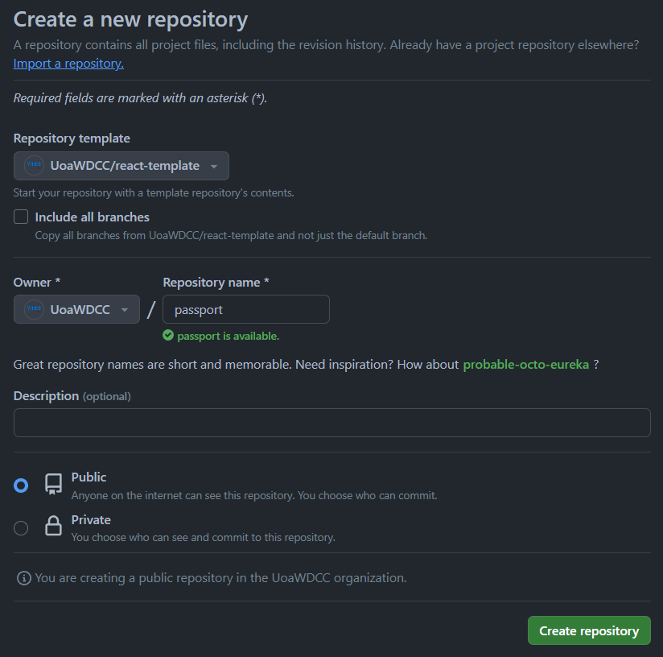
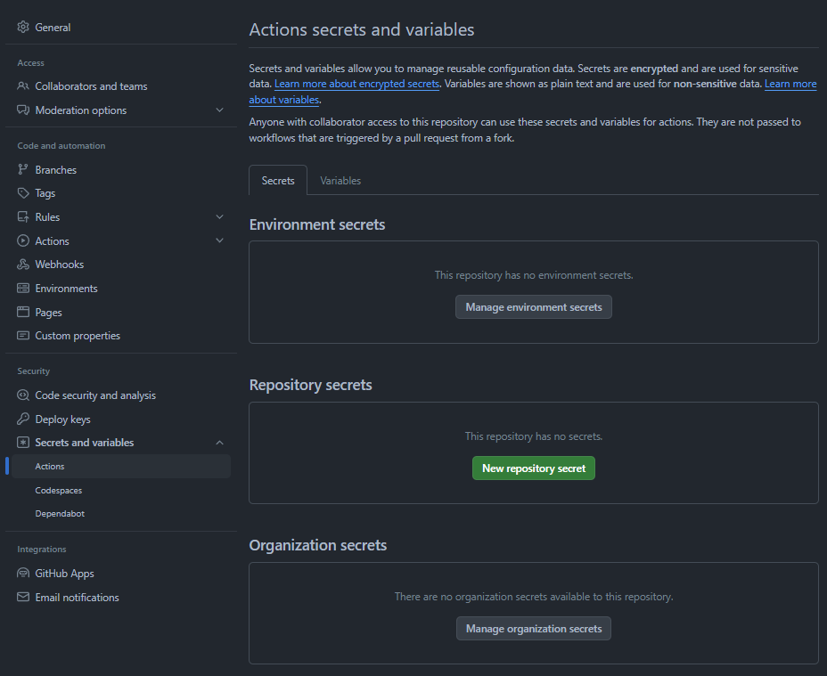

# Community Patrols NZ

## Team

- Project Manager - Isaac Lee
- Tech Lead - Jason Huang
- Frontend - Seth Yoo
- Frontend - Jay Song
- Frontend - Deasy Lie
- Backend - Tuocheng (Tony) Li
- Backend - Joey Sehan Back
- Backend - 
- Front & Back - Raymond Yang
- Front & Back - Cedric Yu
- Designer - Lucy Zhu

## Tech Stack

- React
- Node.js
- Express.js

## Setup Runbook

1.  Create a new repository with UoAWDCC as owner
2.  Select repository template as `UoAWDCC/react-template`

    

3.  Clone the app to your local machine

4.  In `/api/fly.production.toml` change the app name to `wdcc-app-name-api` . For example, passport will be `wdcc-passport-api`
    Then create the app on fly with this command:

    ```jsx
    PS C:\Users\alexw\OneDrive\Documents\GitHub\UoAWDCC\passport> fly apps create --name wdcc-passport-api --org wdcc-projects
    New app created: wdcc-passport-api
    ```

5.  In the`/api` directory run

    ```jsx
    PS C:\Users\alexw\OneDrive\Documents\GitHub\UoAWDCC\passport\api> fly tokens create deploy --config fly.production.toml
    FlyV1 ...IFIc=
    ```

    - Copy the output to your clipboard
    - Go to repository settings on Github
    - In secrets and variables select actions

    

    - Create a new repository secret
    - Name it `FLY_API_PRODUCTION_API_TOKEN` and paste in the secret

6.  In `/api/fly.staging.toml` change the app name to `wdcc-app-name-api-staging`
    Then create the app on fly with this command

        PS C:\Users\alexw\OneDrive\Documents\GitHub\UoAWDCC\passport> fly apps create --name wdcc-passport-api-staging --org wdcc-projects
        New app created: wdcc-passport-api-staging

7.  In the `/api` directory run

    ```jsx
    PS C:\Users\alexw\OneDrive\Documents\GitHub\UoAWDCC\passport\api> fly tokens create deploy --config fly.staging.toml
    FlyV1 ...IFIc=
    ```

    - Copy the output to your clipboard
    - Go to repository settings on Github
    - In secrets and variables select actions
    - Create a new repository secret
    - Name it `FLY_API_STAGING_API_TOKEN` and paste in the secret

8.  In `/web/Dockerfile.production` change

    ```jsx
    ENV VITE_API_URL="https://react-template-api.fly.dev"
    ```

    to

    ```jsx
    ENV VITE_API_URL="https://wdcc-app-name-api.fly.dev"
    ```

    (change it to to the name of your production api app that you just created before

9.  In `/web/Dockerfile.staging`change

    ```jsx
    ENV VITE_API_URL="https://react-template-api-staging.fly.dev"
    ```

    to

    ```jsx
    ENV VITE_API_URL="https://wdcc-app-name-api-staging.fly.dev"
    ```

    (change it to to the name of your staging api app that you just created before

10. In `/web/fly.production.toml` change the name of the app to `wdcc-app-name` and run `fly apps create --name wdcc-app-name --org wdcc-projects`
11. Now run `fly tokens create deploy --config fly.production.toml` and save that as a Github repository secret with the name `FLY_WEB_PRODUCTION_API_TOKEN`
12. In `/web/fly.staging.toml` change the name of the app to `wdcc-app-name-staging` and run `fly apps create --name wdcc-app-name-staging --org wdcc-projects`
13. Now run `fly tokens create deploy --config fly.staging.toml` and save that as a Github repository secret with the name `FLY_WEB_STAGING_API_TOKEN`
